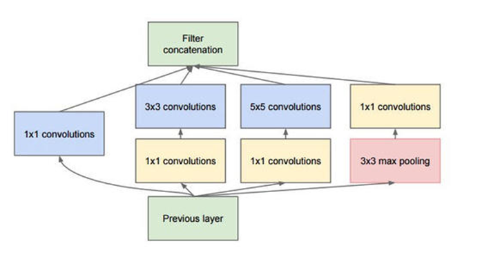
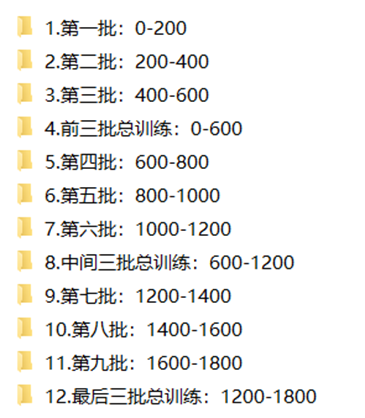
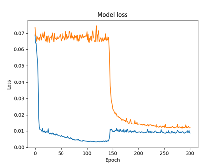
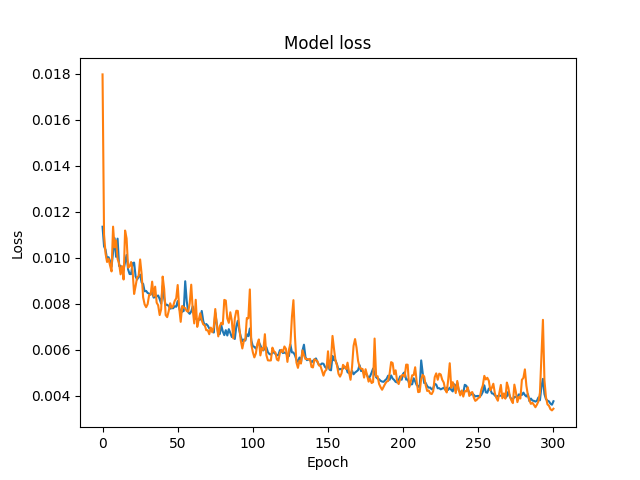

# 基于Unet网络的信息隐藏算法设计与实现

## 1 介绍

&emsp;&emsp;图像信息隐藏是指以数字图像为载体，在能够任意公开传播的图像中嵌入隐藏信息以达到秘密通信的效果，一张图片可能包含人们所察觉不到的秘密信息。具体来说，是发送方在第三者察觉不到的情况下将秘密信息公开地传送给接收方。发送方只需通过一个特定的编码器将秘密图像嵌入载体图像，而接收方则利用解码器将其提取出来即可，编码器解码器两者相互独立。框架如下图所示:

信息隐藏框架

&emsp;&emsp;随着因特网与移动互联网的发展，数以亿计的图片在网络中传播，而这些图片便是极佳的隐藏载体，其传播渠道便可用来传送秘密信息，相关人员利用这些技术可以保证秘密信息的隐蔽性和安全性。其主要应用于信息安全、图像水印、数字版权保护等领域。

## 2 基于U-Net网络的信息隐藏算法实现细节

### 2.1 引言

&emsp;&emsp;Baluja首次使用一个全卷积神经网络实现了以图藏图,该网络端到端地训练了包含秘密信息预处理，秘密信息嵌入和秘密信息提取地多模块CNN网络，网络结构如下图所示：

Baluja提出的图像隐写框架

&emsp;&emsp;如上图所示，整个系统分为三个网络，Network1（预处理网络）负责对待隐藏的图像信息进行预处理，Network2（隐藏网络）负责将预处理之后的秘密图像嵌入载体图像中，Network3（提取网络）负责将含秘图像中的秘密信息提取出来。其中，Network1和Network2组成隐藏器被发送者使用，Network作为提取器被接收者使用，虽然这三个网络被分为两部分使用，但这三个组件被作为一个单独的网络使用。该方法为后来人们使用卷积神经网络进行大容量数字图像信息隐藏提供了思路，随后很多研究者都参照此结构提出了许多改进的方法。然而这些方法与传统计算机视觉领域的全卷积神经网络还有所区别，具体体现在这种基于全卷积神经网络的图像隐藏网络不会引入池化层，这是为了尽量避免图像信息在池化过程中导致的信息丢失，然而这导致人们不得不使用简单的大量堆叠来保证信息嵌入与提取的效果，这种弊端不可避免地使得训练网络参数的大量增加，大大提高了训练成本，也增加了陷入局部最小值的风险。笔者受到U-Net网络“跳跃连接”思想的启发，引入池化层，设计了一种基于U-Net网络的隐写结构。该结构使用跨层连接，通过简单的拼接有效地对下采样阶段中丢失的信息进行补偿，达到了大容量信息隐藏的目的，减少了网络复杂度，实现了良好的效果。

### 2.2 技术框架

&emsp;&emsp;本节将对该信息隐藏算法的整体架构进行阐述，网络框架如下图所示：

信息隐藏网络整体架构

&emsp;&emsp;本方案与Baluja的方案类似，也是“预处理-嵌入-提取”网络，其中“预处理-嵌入”网络组成信息嵌入模块，“提取”网络组成信息提取模块。首先，秘密图像会经过一个U-Net网络进行预处理，该网络的功能是提取秘密图像的特征信息，经过该网络后会生成各个维度的特征图，该过程会提取出秘密图像各个维度的信息以备嵌入。随后，载体图像同样会经过一个类似的U-Net网络结构，该网络的功能是在载体图像中嵌入秘密图像以生成含秘图像。生成含秘图像的过程中，每个阶段的特征图除了得到原载体图像的信息补偿之外，还会得到秘密图像预处理网络相同阶段的特征图的信息补偿。因此，秘密信息嵌入网络在上采样阶段会得到两个方向的信息补偿，分别是自身在下采样过程中同阶段的特征信息和秘密图像在同阶段上采样过程中的特征信息。经过预处理和嵌入网络之后，会生成含秘图像，此时第一阶段发送者的任务完成。第二阶段接收者从含秘图像中提取信息，秘密提取网络的结构是一个简单的堆叠网络，共有五组，每组由一个Inception模块和一个Residual Block模块组成，Inception即为GoogLeNet网络的基本模块，Residual Block即为ResNet网络的基本模块。各个模块的基本结构会在下一节详细解释。经过这五组共十层基本模块的堆叠网络的提取后，可以有效地提取含秘图像中关于秘密图像各个维度的信息并生成秘密图像。其中Inception模块负责从各个维度提取信息，Residual Block模块在其基础上进一步优化提取过程。

### 2.3 详细方案

&emsp;&emsp;下面将详细介绍秘密图像嵌入载体图像及其提取的过程，包括秘密图像预处理，秘密图像在载体图像上的嵌入以及从含秘图像中对秘密图像提取的过程。其中秘密图像，载体图像，含秘图像都是大小256×256的RGB图像。

#### 2.3.1 秘密图像嵌入过程

&emsp;&emsp;秘密图像的嵌入网络（包括预处理和信息嵌入）如下图所示：

秘密图像的嵌入网络

&emsp;&emsp;完整的预处理与嵌入网络由上下两个U-Net网络组成，其中上方的网络负责秘密图像的预处理过程，对秘密图像进行预处理得到各个维度的特征图，设输入的秘密图像$S\in\mathbb{R}^{H\times W\times C}$，预处理之后得到的特征图为$S_P\in\mathbb{R}^{H\times W\times C_s}$，其过程可以表示为下式：

$$
S_P=f_P^{U-Net}\left(S;\theta_P\right)
$$

&emsp;&emsp;其中$f_P^{U-Net}(·)$可以表示为图中上半部分的U-Net网络，该网络中的参数由参数集合$\theta_P$表示。
&emsp;&emsp;图中下半部分的U-Net网络负责对载体图像的特征进行提取同时接受秘密图像的特征信息以实现信息的嵌入。该网络在下采样阶段与预处理网络结构相同，功能也相同，都可以提取输入图像各个维度的信息；在上采样阶段，该网络不仅会受到来自同层下采样阶段的特征图的信息补偿，同时也会受到来自预处理网络对秘密图像同层上采样阶段产生的特征图的信息补偿，以此来实现嵌入。因此，使用这种方式，不仅可以使得生成的含秘图像最大可能地保留原载体图像的细节信息，而且可以全面的嵌入秘密图像各维度的细节信息。设下半部分U-Net网络输入的载体图像为$H\in\mathbb{R}^{H\times W\times C}$，则该嵌入网络会将秘密图像各维度的特征图与载体图像相应维度的信息进行通道方向的拼接，这种方式可以在秘密信息的嵌入过程中，含秘图像的生成能充分考虑到秘密图像的分布与特征，因此网络的总输入应为$concat\left[H,S_P\right] \in\mathbb{R}^{H\times W\times\left({C+C}_s\right)}$。因此，整个嵌入过程可表示为：
$$
H^\prime=f_H^{U-Net}\left(concat\left[H,S_P\right];\theta_H\right)
$$

&emsp;&emsp;其中$S_P$即为上述过程“$S_P=f_P^{U-Net}(S;\theta_P)$”的结果。
&emsp;&emsp;值得一提的是，整个网络的最后一步是Sigmoid标准化，最终输出图片要求每个像素值为一个0到1的浮点数。（因为最终的图片像素格式要求是0-1的浮点数）
&emsp;&emsp;整个网络充分利用了U-Net网络的特点，利用下采样充分提取各个维度的特征信息，同时通过“跳跃连接”尽量对下采样过程中丢失的信息进行补偿，减少了失真效果，保证了生成的含秘图像在充分嵌入秘密图像信息的前提下仍能有较高的视觉质量。

#### 2.3.2 Inception模块详细设计

&emsp;&emsp;原始版本的Inception模块结构如下所示：

Inception模块结构

&emsp;&emsp;Inception模块的核心思想就是将不同的卷积层通过并联的方式同时进行卷积，经过不同卷积层处理的结果矩阵进行通道方向的拼接，形成一个更深的矩阵。Inception模块可以反复叠堆形成更大的网络，它可以对整个网络结构的宽度和深度进行有效的扩充，同时在提升网络准确率的同时防止过拟合现象的发生，避免陷入局部最优。Inception模块的优点是可以对尺寸较大的矩阵先进行降维处理的同时，在不同尺寸上对视觉信息进行聚合，方便从不同尺度对特征进行提取。
&emsp;&emsp;Inception的原始论文指出：当感兴趣区域分布更全局时，倾向选择一个较大的核；当感兴趣区域分布的更局部时，倾向选择一个较小的核。在本次的秘密信息提取任务中，提取出的信息在全局上的优先级要比在局部的优先级高，因为任务目标主要是尽可能地使肉眼识别不出秘密信息嵌入之前和提取之后的区别，尽管局部细节信息同样非常重要，但对肉眼来说，图像的整体结构往往更能表现出图像的特征，而数字图像级别的细节往往识别不到，因此笔者在选择Inception模块的具体结构时，倾向于选择更大的卷积核，经过提取信息准确度和训练成本之间的权衡，实验结果显示卷积核3，4，5效果相对最好。因此，Inception模块具体结构如下图所示：

本模型所设计的Inception结构

&emsp;&emsp;如上图，输入张量除了第一层的通道数为3之外（因为输入图像是RGB形式），其余层的输入通道数都是65；卷积核有3，4，5三种不同的大小，而卷积核越小，所提取出的通道数也越多，这是因为小的卷积核提取细节信息，而细节信息相对较多，而大的卷积核提取出的通道数相对较少，因为大的卷积核提取出更多的图像的整体结构。值得一提的是，三种卷积操作的步长都是1，并且3×3和5×5的卷积核padding分别是1和2，这可以保证卷积前后的feature map大小不变，而4×4的卷积核padding是1（如果大于1会导致feature map更大），这导致该卷积核卷积出来的大小为$255^2$，为了保证卷积之后的大小不变，分别在feature map的最后一行和最后一列补一层0，即为上图中中间红色箭头的操作。
&emsp;&emsp;经过三个不同卷积操作之后，将通道数不同大小相同的feature map进行通道方向的拼接，因此总通道数变为65，然后会输入到下一层进行下一步操作。

#### 2.3.3 Residual Block模块详细设计

&emsp;&emsp;为了进一步优化提取网络结构，提高网络的准确性，考虑在其基础上多添加几层网络，但根据实验结果显示，网络层数的增加往往不会使得训练更好，反而会产生梯度爆破或者梯度消失的问题，使用ResNet可以有效地避免网络的退化，因为残差网络和其他的网络最大的不同就是多了一条identity的直连分支。而因为这一条分支的存在，使得网络在反向传播时，损失可以通过这条捷径将梯度直接传向更前的网络，从而减缓了网络退化的问题。
&emsp;&emsp;基于上述考虑，针对该任务提出如下图所示的Residual Block模块结构：

针对性的Residual Block模块结构

&emsp;&emsp;与传统的Residual Block结构不同，本方案在卷积之后没有使用ReLU而是选择使用LeakyReLU作为激活函数。这是因为ReLU函数的输出值总是非负的，输入为负时往往也代表了图像中的某些信息而这部分信息被舍弃掉了，而采用LeakyReLU在输入为负时也能很好得保存这部分信息。

#### 2.3.4 秘密图像提取网络结构

&emsp;&emsp;整个提取网络的主体结构是由上述Inception模块和Residual Block模块组成，完整结构如下图所示：

完整的秘密图像提取网络

&emsp;&emsp;值得一提的是，除最后一层因为图片格式的要求之外，整个网络（包括隐藏网络）不再涉及归一化层，因为在网络中间的归一化层会导致像素级别的原始的颜色，亮度等信息的丢失，容易导致最终结果的视觉质量下降。

### 2.4 训练过程

&emsp;&emsp;网络训练过程主要涉及到两部分，分别是损失函数设计和训练策略。首先根据模型要求设计合适的损失函数，再根据该损失函数和训练成本选择适当的训练策略。

#### 2.4.1 损失函数设计

&emsp;&emsp;考虑到模型评估的各个指标，本算法的评估可视为载体图像与含秘图像，秘密图像与提取出的秘密图像之间的区别，因此总损失可视为这两组图片之间的视觉差别。
&emsp;&emsp;关于两张图片之间区别的评估方式，有许多不同的评价函数，如欧氏距离，峰值信噪比RSNR，图像结构相似度SSIM等。经过实验对比，最终选择图像结构相似度作为两张图片之间相似程度的评判标准。
&emsp;&emsp;图像结构相似度SSIM是一种将亮度，对比度，结构变量从图像中分离出来的评判标准，计算公式如下：

$$
SSIM\left(O,R\right)=\frac{\left(2\mu_O\mu_R+c_1\right)\left(2\sigma_{OR}+c_2\right)}{\left(\mu_O^2+\mu_R^2+c_1\right)\left(\sigma_O^2+\sigma_R^2+c_2\right)}
$$

&emsp;&emsp;其中，O和R分别表示原图像、处理后的图像，$\mu_O$和$\mu_R$是平均值，$\sigma_O$和$\sigma_O$是方差，$\sigma_{OR}$是协方差，$c_1=\ {(k_1\ \times\ l)}^2$，$c_2=\ {(k_2\ \times\ l)}^2$，我们一般默认设置为k_1=0.01 ，k_2=0.03，l=255。SSIM 值在 0 到 1 之间，越接近1，表示两幅图像之间的越相似。
&emsp;&emsp;综上所述，整个网络的总损失函数为：
$$
Loss(H,H',S,S')=1-SSIM(H,H')+β×1-SSIM(S,S')
$$

&emsp;&emsp;其中H表示载体图像，$H^\prime$表示含秘图像，S表示秘密图像，$S^\prime$表示提取出的秘密图像，$\beta$是权重。整个训练过程同时涉及秘密嵌入网络和秘密提取网络，需要注意的是对于损失函数中的$(1-SSIM\left(H,H^\prime\right))$，该部分与提取网络无关，并不会参与到对提取网络参数的求导，直观的理解就是提取网络的任务只是尽可能的提高秘密图像在嵌入前与提取之后的相似度，并不涉及载体图像与含秘图像之间的关系。而对于损失函数中的$\beta\times(1-SSIM\left(S,S^\prime\right))$，该部分对嵌入和提取这两个网络结构都有影响，因为除了提取网络要考虑提取图片的质量之外，嵌入网络也要尽可能地将秘密信息嵌入以保证提取图片的质量。根据Baluja的工作成果，$\beta$取值为0.75，1，1.25时，网络的效果几乎相同。因此考虑到性能上的要求，我们将$\beta$设置为0.75。

#### 2.4.2 训练策略

&emsp;&emsp;基于网络模型参数量和设备性能的考量，选取1800张图片（共900对）进行训练。
&emsp;&emsp;将1800张图片分成9组，每组二百张，进行分组训练。在训练时，使用 Adam 优化器来加速网络的收敛，优化网络模型，设置为0.0001的学习率，Batch大小为8，训练轮数为300轮。
&emsp;&emsp;整个训练大体过程如下：首先将第0-200张图片训练300轮，然后将再将第200-400张训练300轮，再将第400-600张图片训练300轮，出于防止过拟合的考虑，最后将这0-600张图片一起训练300轮，以上的步骤作为一大组。因此，一大组总共训练600张，总共训练3大组，每一大组为4个阶段，因此总共进行了12个阶段的训练，过程文件保存结构如下图所示：

训练过程

&emsp;&emsp;首先将第0-200张图片训练300轮，训练过程中损失变化如下图所示：

第一阶段：第0-200张的训练过程

&emsp;&emsp;橙色折线代表秘密图像和提取图像之间的损失，蓝色折线代表载体图像与嵌入图像之间的损失，图中可以看到提取图像的损失相对较高，而且在初期不收敛，在第150轮左右才开始收敛。
&emsp;&emsp;接下来保存第一阶段训练的参数，进行迁移学习，使用第200-400张图片训练300轮，过程如下所示：

第二阶段：第200-400张的训练过程

&emsp;&emsp;可以看到，因为第200-400张图片和第0-200张图片毫无关系，所以在最初几轮，损失值几乎和没有训练时一样高，貌似迁移学习没有起到作用，然而经过几轮的训练我们可以发现，此次模型的收敛速度非常快，经过前几轮就迅速收敛，在第25轮左右又进行了一次大的收敛，最终损失值渐渐变为与第一轮的最终结果类似。
&emsp;&emsp;第二阶段训练结束后，我们进行第三阶段的训练，此时的训练样本变为第400-600张图片，过程如下图所示：

第三阶段：第400-600张的训练过程

&emsp;&emsp;可以看到，模型经过最初的几轮训练之后，迅速收敛，这说明随着训练阶段的进行，收敛速度越来越快，模型效果也越来越好。
&emsp;&emsp;经过上述三个不同图片阶段的训练，模型已经初步具有效果了。基于防止过拟合的考量，将前三阶段的所有图片即第0-600张图片一次性训练300轮，训练结果如下所示：

第四阶段：第0-600张的训练过程

&emsp;&emsp;可以看到，此次训练的样本数是前三阶段的三倍，因此在第100轮之后的损失变化更加平滑，但总体还是在下降。
&emsp;&emsp;接下来的几个阶段的训练就不再赘述，结果如下图所示：

五：600-800张的训练过程 六：800-1000张的训练过程 七：1000-1200张的训练过程 八：600-1200张的训练过程

  

九：1200-1400张的训练过程 十：1400-1600张的训练过程 十一：1600-1800张的训练过程 十二：1200-1800张的训练过程

&emsp;&emsp;可以看出，随着训练的不断进行，损失函数数值的数量级也在不断减小，同时在单次训练中损失值也在稳定下降。
&emsp;&emsp;同时我们可以注意到，在后面几个训练阶段中，损失发生了较大的波动，这说明模型已经位于局部最小值。若要继续训练，必须要使用更小的学习率，而此时的学习率已经是0.0001，在这种情况下，即使减少学习率进一步训练，所带来的效果依旧有限，不过此时的训练效果已经极好，在第十二阶段的第三百轮时，已经可以达到人体肉眼识别不出的程度，效果如下图所示：

最终训练效果，从上到下依次是：秘密图像；提取后的秘密图像；载体图像；含秘图像

&emsp;&emsp;上述图像是在训练集上的结果，我们在测试集上获得的结果如下所示：

在测试集上的结果，排布与上图相同

&emsp;&emsp;可以看到，测试集上的结果已经基本与训练集上的结果相同，这说明此时模型已经具有很好的泛化能力。此时的模型在任何图片上集上几乎都可以达到理想的效果，成像自然清晰，并不会引起攻击者的注意。

#### 2.4.2 训练环境

&emsp;&emsp;训练学习率为0.0001，使用Adam 优化器，每次批图像数量（即batch size为8），每阶段训练进行300次迭代，GPU版本为NVIDIA GeForce RTX 3090，实验环境为PyTorch。

### 2.5 训练策略信息隐藏系统设计

&emsp;&emsp;本节将使用基于上述方案所得模型集成到一个前端，交互界面如下图所示：

信息嵌入界面及信息提取界面

&emsp;&emsp;如图，主界面为一个嵌入界面和一个提取界面，可以用以选择图片文件，进行嵌入和提取。
&emsp;&emsp;使用界面如下：

信息嵌入界面及信息提取界面

### 2.6 小结

&emsp;&emsp;本节详细介绍了该算法的实现细节，包括信息隐藏网络和信息提取网络等，通过采用U-Net的特点，通过在各个维度进行信息补偿的方式成功地将秘密图像嵌入到载体图像中。在提取网络中，使用Inception模块从各个维度提取秘密图像的信息并通过叠加Residual Block模块地方式进一步优化结构。因此该网络模型可以实验彩色图像嵌入与提取的基本要求。
&emsp;&emsp;另外，本章还针对该模型的结构以及任务要求针对性地设计了损失函数，并基于此设计了一个简单有效成本低廉的训练策略。结合上述模型的基本结构，为此类任务提出了一个完整的解决方案，具有一定的现实意义。

## 3 结果与分析

### 3.1 数据集设置

&emsp;&emsp;模型训练所使用的数据集是ImageNet，ImageNet是一个超过1500万张高分辨率图像的数据集，被广泛用于模式识别，图像分类，目标定位，目标检测等。
&emsp;&emsp;训练集使用了ImageNet中测试集中的前1800张，其中第偶数张作为载体图像，第奇数张作为秘密图像。并且会对输入的图像进行预处理，预处理的详细过程如下：

1. 将输入图像resize为大小IMG\_SIZE×IMG\_SIZE的图像（由于硬件的限制，IMG\_SIZE默认设置为256，若有显存更大的GPU，可在config.py中设置更大的图像规格），
2. 将数字图像从image类型转换为Tensor类型以便模型处理。
3. 若图像的通道数不是3（ImageNet存在某些单通道的图像），则将图像的通道数变为3，方法是通道方向的拼接。

### 3.2 实验结果分析

&emsp;&emsp;图像的视觉效果是能否实现信息隐藏的重要前提，因此我们首先保证图像在视觉效果上能够不被察觉，使用非训练集的任意图片作为测试，效果如下：

从左到右依次为秘密图像；提取出的秘密图像；载体图像；嵌入信息的载体图像

&emsp;&emsp;可以看到，从生成的含秘图像和提取出的秘密图像来看，图像是自然且清晰的，不会引起第三方的察觉。
&emsp;&emsp;除定性的判断之外，还要进行定量的检测。训练时使用的损失函数是基于结构相似度SSIM设计的，因此对于定量的检测，我们使用峰值信噪比PSNR和图像的直方图作为标准。
&emsp;&emsp;峰值信噪比PSNR是一种基于MSE（均方误差）的算法。它是原图像与被处理图像之间的均方误差相对于${(2^n-1)}^2$的对数值(信号最大值的平方，n是每个采样值的比特数)，它的单位是dB，PSNR值越大，就代表失真越少。其公式如下所示：

$$
PSNR=10\times\log_{10}({\frac{\left(2^n-1\right)^2\times H\times W}{\sum_{i=1}^{H}\sum_{j=1}^{W}\left(X\left(i,j\right)-Y\left(i,j\right)\right)^2}})
$$

&emsp;&emsp;其中，n代表图像采样点的位数，对于RGB图像而言，n=8；X(i,j)表示图像X第i行第j列像素点的数值，Y(i,j)代表图像Y第i行第j列像素点的数值，H和W代表图像的高和宽，这里我们视为256。
&emsp;&emsp;我们使用测试集中随机的500张图像，测试其秘密图像与提取出的秘密图像，载体图像与含秘图像之间的PSNR值，获得了较好的数据。
&emsp;&emsp;图像直方图是用来表现图像中亮度分布的直方图，给出的是图像中某个亮度或者某个范围亮度下共有几个像素，即统计一幅图某个亮度像素数量。
&emsp;&emsp;图像直方图由于其计算代价较小，且具有图像平移、旋转、缩放不变性等众多优点，广泛地应用于图像处理的各个领域，特别是灰度图像的阈值分割、基于颜色的图像检索以及图像分类。
&emsp;&emsp;使用任意非训练集图像进行测试，结果如下图所示：

第一行为图片，第二行为直方图，从左到右的顺序同上图

&emsp;&emsp;可以看到，图像变换前后图像的高低频信息总体趋势几乎没有变化，几乎没有大的像素误差，说明嵌入和提取效果在客观数值的仍有较好的反应。

### 3.3 小结

&emsp;&emsp;本节作为整个课题的最后一部分，对整个过程进行总结和评估，首先介绍了训练模型所使用的数据级集以及其预处理的格式。然后说明了训练环境，包括训练策略，硬件条件，深度学习框架等，最后对模型分别进行了定性和定量的评估，我们可以看到不仅肉眼很难识别，而且在PSNR和直方图的客观评判下也有很好的表现效果。

## 4 总结与展望

### 4.1 总结

&emsp;&emsp;随着现代互联网产业的发展，多媒体信息呈指数级增长，这类信息的隐私与安全问题受到业界与学界的广泛关注。而数字图像信息隐藏作为一种方兴未艾的技术恰好符合当今高速发展的信息化时代的需求，社会与市场上对一个高效实用的信息隐藏算法的需求也越来越大，在这股风潮之下信息隐藏技术也受到越来越多学者的关注。
&emsp;&emsp;卷积神经网络作为计算机视觉领域中应用最广泛的算法，以其学习能力强，适应性好，数据驱动的优点成为该课题不可或缺的工具。本课题基于卷积神经网络的基本原理，采用几个经典的结构，设计了一系列简洁有效的模型结构以及低廉的训练策略，为此类问题提出了一个完整的解决方案，总结具体如下：

1. 基于U-Net网络的信息隐藏网络，利用U-Net网络的特性，通过信息补偿的方式将秘密图像和载体图像进行特征融合，在完美的嵌入秘密图像信息的同时，形成了视觉质量较高的含秘图像。
2. 基于Inception模块和Residual Block模块的信息提取网络。利用Inception模块的特点对含秘图像中的隐藏信息进行各个维度与尺寸的提取，同时通过Residual Block模块进一步提取深层特征，最大可能得将含秘图像中的信息提取出来并生成原秘密信息。
3. 针对模型和该任务的特点。设计了一个成本低廉简洁有效的训练策略，利用迁移学习的思路，成功在较短时间内训练出了具有良好泛化能力的模型。

### 4.2 研究展望

&emsp;&emsp;本课题提出的信息隐藏技术具有广阔的应用前景，诸如数字版权保护，图像和视频水印，或者军事等，本课题的结果可以为这些应用提供可行的技术支持。
&emsp;&emsp;信息隐藏算法的关键是大容量嵌入，隐秘传输以及无损提取，尽管本文提出的算法可以在大多输公共数据集上表现出良好的效果，然而由于该模型本身的某些制约，在现实应用中仍然存在某些亟待解决的问题，可寻求进一步的讨论与解决。
&emsp;&emsp;例如，由于U-Net网络起初是用作解决图像分割任务的模型，其网络结构的“跳跃连接”等特点尽管可以很好地实现图像分割，然而在信息隐藏任务中嵌入信息时，若图像色彩存在渐变效果（例如光晕等），则图像在渐变区域会被网络处理产生清晰的轮廓，如下图所示：

如上图分别是嵌入信息前的载体图像和经过网络处理的含秘图像

&emsp;&emsp;基于此，进一步改善模型，解决或减缓该固有问题是一个优化方向。
&emsp;&emsp;其次，鲁棒性也是信息隐藏算法中的一个重要的评价指标，尽管本算法可以抵抗一定程度的安全性分析，然而由于嵌入的过多的信息，因此实验证明本算法的鲁棒性较差，当在含秘图像上添加随机噪声时，即使对含秘图像在肉眼识别尺度上的影响不大，但仍能严重影响信息提取效果，如下图所示：

噪声对信息提取的影响

&emsp;&emsp;因此，如何抵抗噪声干扰，增强算法的鲁棒性同样是一个困难，希望后续研究能解决这一问题。